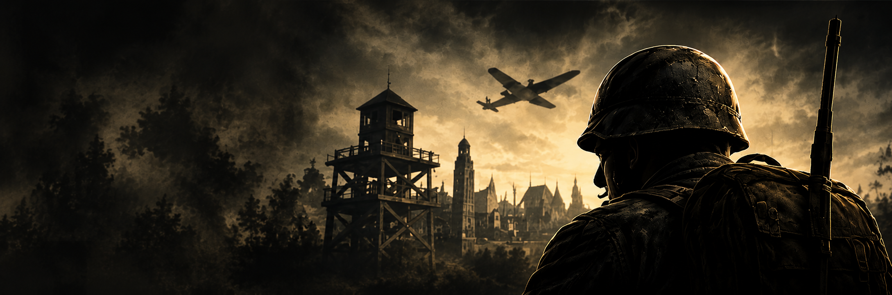

# HD Radar — trainer pour Hidden & Dangerous Deluxe

> Un trainer pour un jeu de 2002 dont on n'a pas le code source : radar et ESP en surimpression, création et contrôle d'escouades, clonage de véhicules, et deux petits utilitaires qui donnent au PC hôte l'autorité sur l'IA ennemie en coopération LAN. Environ 35 000 lignes de C++, construites en lisant et en modifiant le `hde.exe` en cours d'exécution, depuis l'extérieur.

[](https://isocpp.org/)
[](#compiler-depuis-les-sources)
[](#architecture)
[](https://github.com/ocornut/imgui)
[](https://cmake.org/)
[](LICENSE)

🇬🇧 [Read this document in English](README.md)

<p align="center">
  
</p>

---

## Téléchargement

La version finale est publiée en **Release GitHub** — trois exécutables, sans installateur :

| Fichier | Où il tourne | Rôle |
|---|---|---|
| `HDFinalAdvanced.exe` | PC hôte | Le trainer : surimpression, radar, raccourcis, outils soldats et véhicules |
| `HD_AI_AUTHORITY_HOST.exe` | PC hôte, avec le trainer | Rend chaque ennemi local à l'hôte, pour que son IA y tourne |
| `HD_AI_AUTHORITY_CLIENT.exe` | Chaque PC ami | Rend chaque ennemi distant, pour que son IA ne tourne **pas** deux fois |

Les empreintes SHA-256 sont dans les notes de la release. Windows Defender et SmartScreen signalent souvent les trainers, puisqu'ils lisent et écrivent la mémoire d'un autre processus ; le code source complet est ici pour vérifier ce que font les exécutables.

**Prérequis :** Hidden & Dangerous Deluxe (`hde.exe`, 32 bits) avec l'Ultimate Mod 5.0, Windows 10/11.

---

## Ce qu'il fait

### Raccourcis clavier

| Touche | Action |
|---|---|
| **F3** | Sortir du véhicule — même en vol ou coincé |
| **F4** | Santé max : un appui étend et remplit, un second annule |
| **F5** | Fullhands : série d'armes suivante |
| **F6** | Liste des véhicules de la mission — **Entrée** vole un véhicule jusqu'à vous, **C** crée une copie conduisible |
| **F7** | Passer la mission, synchronisé sur les deux PC |
| **F8 / F9** | Vitesse du joueur : augmenter / réduire |
| **F10** | Ranimer le soldat contrôlé |
| **F12** | Restaurer l'image du soldat (squelette après une explosion) |
| **G** (à pied) | Fenêtre des soldats — voir ci-dessous |
| **G** (au volant) | Réparer le véhicule |
| **K** | Carte native — téléportation, ou ordre donné à l'escouade sélectionnée |

### Fenêtre des soldats

- **Créer de 1 à 50 soldats** en grille devant vous, copiés de votre soldat actuel : ils portent donc exactement votre uniforme de mission.
- **Prendre le contrôle** de n'importe lequel et le piloter exactement comme votre propre soldat : clavier, caméra, visée, carte.
- **Donner un ordre à une escouade** — sélectionner *Tous* ou *Groupe*, appuyer sur **K**, cliquer un point sur la carte native : ils s'y rendent.
- **Rallier des ennemis** à votre camp, et les envoyer avec *FEU* / *FEU ALL* / *VENIR*.

### Surimpression

- **Radar** avec les positions ennemies et alliées, projetées depuis la matrice vue-projection du moteur lui-même
- **ESP** ennemis et alliés, activables séparément
- **Suivi des balles** — cercle d'impact et traceur
- Une fenêtre de contrôle Dear ImGui rendue en DirectX 9

### Utilitaires d'autorité LAN

Hidden & Dangerous est pair-à-pair : chaque PC simule les ennemis qu'il considère comme locaux. En coopération, deux PC peuvent donc faire tourner l'IA du même ennemi et diverger sur sa position. Les deux utilitaires imposent **une seule décision de propriété sur les deux machines** : l'hôte marque tous les ennemis comme locaux, le client les marque tous comme distants — la branche IA de `C_enemy::Tick` ne tourne alors que sur l'hôte. Ils communiquent par un canal UDP privé.

---

## Comment ça marche

Il n'existe ni SDK ni code source pour le binaire visé. Chaque fonction repose sur des faits mesurés dans le processus en cours :

- **Les offsets et structures sont mesurés, pas devinés.** Tables d'acteurs, base d'inventaire, tableau des sièges de véhicule et champ de propriétaire réseau ont chacun été localisés en sondant la mémoire, et les scripts de sonde sont conservés dans [`tools/`](tools/).
- **Les fonctions sont retrouvées par signature.** `CreateActor`, le global `driver` et la routine de dégâts du joueur sont résolus par signature d'octets dans le binaire de l'utilisateur. Si une signature ne se résout pas, la fonction est **désactivée et signalée** dans le journal plutôt que tentée à l'aveugle.
- **Les appels moteur s'exécutent sur le fil du moteur.** Créer un soldat enchaîne six appels au moteur ; ils sont exécutés sur le propre fil du jeu plutôt que depuis le trainer, et c'est ce qui a mis fin au plantage à la création.
- **Les limites du moteur sont respectées.** Le bandeau de portraits du haut est un tableau fixe de quatre (`pmenu[MAX_PLAYERS]`) ; les soldats créés sont pleinement jouables mais n'ont délibérément pas de portrait, car écrire au-delà de ce tableau corromprait la mémoire.

### Une correction représentative de la version finale

Le jeu saccadait en pleine mission. Le journal contenait 1 855 lignes, dont 1 473 identiques et horodatées à **la même seconde**. La cause : une fois le hook de dégâts posé, les premiers octets de la fonction devenaient un `JMP` (`E9`), donc la vérification de signature `83 EC 6C 53 55` ne pouvait plus jamais réussir — et l'échec était écrit à chaque image. Chaque ligne coûtait une lecture de taille, une ouverture et une fermeture de fichier, sur le fil qui porte aussi la surimpression.

La version finale garde le fichier ouvert, ne vérifie sa taille qu'une fois toutes les deux secondes, regroupe les lignes identiques consécutives en une seule ligne « répétée N fois », et ne signale chaque échec de signature qu'une fois par adresse.

---

## Architecture

```
src/
├── main.cpp                 fenêtre, boucle de messages, périphérique DirectX 9, raccourcis
├── trainer_ui.cpp           panneau de contrôle Dear ImGui
├── trainer_process.cpp      attache au processus, lecture/écriture mémoire
├── gameplay_mods.cpp        santé, réanimation, véhicules, création de soldats, ordres  (~23k lignes)
├── radar.cpp                instantané des entités, projection écran, surimpression ESP
├── weapon_mods.cpp          séries d'armes, inventaire
├── cheat_sequence.cpp       séquences de codes natifs
├── diagnostics.cpp          journal de diagnostic tamponné (hdradar_diag.log)
└── ai_authority_helper.cpp  utilitaires hôte / client de propriété de l'IA, canal UDP
tools/                       sondes mémoire PowerShell : carte, véhicules, armes, BSP, visibilité
interface/                   visuels du lanceur et icône
engine-port/                 documents de conception du port moteur à autorité de l'hôte
docs/                        journal de développement complet, cahier des charges, plan
```

Trois exécutables sortent d'un seul projet CMake : `HDPhase1` construit le trainer, et une fonction commune construit les utilitaires hôte et client depuis la même source avec une définition de préprocesseur différente. Les utilitaires embarquent le runtime C++ en statique, car le PC d'un ami ne reçoit que ce fichier-là.

---

## Compiler depuis les sources

Nécessite Visual Studio 2022 ou 2026 avec la charge de travail C++, et CMake 3.21+. La cible **doit être Win32/x86** — `hde.exe` est en 32 bits, et le projet refuse de se configurer en x64.

```powershell
.\build.ps1                       # Release, Visual Studio 2026
.\build.ps1 -Preset vs2022-x86    # Visual Studio 2022
.\build.ps1 -Debug
```

Dear ImGui est téléchargé à la configuration et figé sur `v1.91.9b`. Les binaires sont produits dans `build/<preset>/Release/` sous les noms `HDFinalAdvanced.exe`, `HD_AI_AUTHORITY_HOST.exe` et `HD_AI_AUTHORITY_CLIENT.exe`.

## Utilisation

1. Lancer le jeu.
2. **PC hôte :** lancer `HDFinalAdvanced.exe` et `HD_AI_AUTHORITY_HOST.exe`.
3. **Chaque PC ami :** lancer uniquement `HD_AI_AUTHORITY_CLIENT.exe`.
4. Sauvegarder avant d'essayer la création de soldats, et commencer avec **1** soldat, pas 50.

Un journal de diagnostic est écrit à côté de l'exécutable : `hdradar_diag.log`.

---

## État et limites connues

- **Les fonctions locales sont solides ; l'autorité LAN est partielle.** Tout ce qui tourne sur un seul PC — surimpression, radar, ESP, armes, véhicules, soldats — fonctionne. Les utilitaires corrigent la propriété de l'IA, mais ils s'appuient sur le réseau pair-à-pair d'origine : la *protection totale* et la *réanimation* ne sont **pas** garanties identiques sur les deux PC.
- **Les soldats créés n'ont pas de portrait** dans le bandeau du haut, par conception (voir plus haut).
- **Dépendant des signatures.** Construit et mesuré sur le `hde.exe` de l'Ultimate Mod 5.0. Les fonctions dont la signature ne se résout pas sur un autre binaire se désactivent d'elles-mêmes.
- **Le code réseau non testé est mis de côté, pas livré.** Une tentative inachevée de propriété de l'IA ralliée en LAN est conservée dans [`docs/experimental/reseau_non_teste.patch`](docs/experimental/reseau_non_teste.patch) et ne fait pas partie de la version finale.

### Le port moteur

Une seconde piste visait plus loin : reconstruire le moteur lui-même pour que l'hôte soit l'unique source de vérité pour les joueurs, l'IA, les tirs, les dégâts et l'inventaire. Sa conception est documentée dans [`engine-port/`](engine-port/) — changements de protocole, carte de migration, et l'audit qui a relevé les défauts de paquetage. Il compilait, mais **n'a jamais été exécuté**, et son paquet est explicitement marqué non prêt pour les tests.

**Le code source d'origine du jeu, ses binaires et la chaîne d'outils tierce qu'il nécessitait ne sont pas inclus** dans ce dépôt. Ce sont des éléments tiers ; seuls la documentation et les scripts de génération de build écrits pour le port sont publiés.

---

## Documentation

| Document | Contenu |
|---|---|
| [`docs/JOURNAL_DE_DEVELOPPEMENT.md`](docs/JOURNAL_DE_DEVELOPPEMENT.md) | Chaque build, ce qui a changé, pourquoi, et ce qui a été mesuré |
| [`docs/CAHIER_DES_CHARGES.md`](docs/CAHIER_DES_CHARGES.md) | Cahier des charges des escouades, du clonage de véhicule et des ordres par la carte, avec les découvertes moteur qui les rendent possibles |
| [`docs/PLAN.md`](docs/PLAN.md) | Journal technique complet, dont l'audit du port moteur |
| [`docs/NOTES_VERSION_FINALE.txt`](docs/NOTES_VERSION_FINALE.txt) | Notes de la version finale |

## Licence

[MIT](LICENSE) pour le code de ce dépôt. *Hidden & Dangerous* est une marque de ses détenteurs respectifs ; ce projet est non officiel et sans lien avec eux. Dear ImGui est sous licence MIT, par Omar Cornut.
