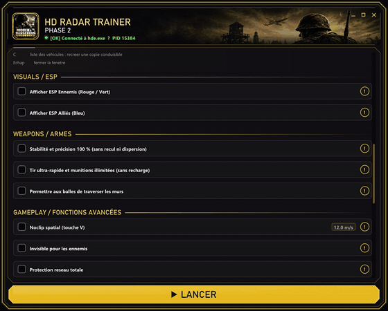

# HD Radar — Hidden & Dangerous Deluxe trainer

> A trainer for a 2002 game whose source you do not have: overlay radar and ESP, squad creation and control, vehicle cloning, and two small helpers that give the host PC authority over enemy AI in LAN co-op. About 35,000 lines of C++, built by reading and patching the running `hde.exe` from outside.

[](https://isocpp.org/)
[](#building-from-source)
[](#architecture)
[](https://github.com/ocornut/imgui)
[](https://cmake.org/)
[](LICENSE)

🇫🇷 [Lire ce document en français](README.fr.md)

<p align="center">
  
</p>

---

## Video

<p align="center">
  <a href="docs/video/demo.mp4"></a>
</p>

<p align="center"><a href="docs/video/demo.mp4"><b>▶ Watch the gameplay recording</b></a> — 4 min 35 s · full-quality original in the <a href="https://github.com/anissfhd/hd-radar-trainer/releases/tag/final">release</a></p>

---

## Download

The final build is published as a **GitHub Release** — three executables, no installer:

| File | Where it runs | Role |
|---|---|---|
| `HDFinalAdvanced.exe` | Host PC | The trainer: overlay, radar, hotkeys, squad and vehicle tools |
| `HD_AI_AUTHORITY_HOST.exe` | Host PC, alongside the trainer | Makes every enemy local to the host, so its AI runs there |
| `HD_AI_AUTHORITY_CLIENT.exe` | Each friend's PC | Makes every enemy remote, so its AI does **not** run twice |

SHA-256 checksums are listed in the release notes. Windows Defender and SmartScreen commonly flag trainers because they read and write another process's memory; the full source is here to check what the executables do.

**Requirements:** Hidden & Dangerous Deluxe (`hde.exe`, 32-bit) with Ultimate Mod 5.0, Windows 10/11.

---

## What it does

### Hotkeys

| Key | Action |
|---|---|
| **F3** | Leave the vehicle — even mid-air or stuck |
| **F4** | Max health: one press extends and fills, a second press cancels |
| **F5** | Fullhands: cycle to the next weapon set |
| **F6** | Mission vehicle list — **Enter** steals a vehicle to your position, **C** spawns a drivable copy |
| **F7** | Skip the mission, synchronized on both PCs |
| **F8 / F9** | Player speed up / down |
| **F10** | Revive the controlled soldier |
| **F12** | Restore the soldier's model (skeleton left after an explosion) |
| **G** (on foot) | Soldier window — see below |
| **G** (driving) | Repair the vehicle |
| **K** | Native map — teleport, or give an order to the selected squad |

### Soldier window

- **Create 1 to 50 soldiers** in a grid in front of you, cloned from your current soldier, so they wear your exact mission uniform.
- **Take control** of any of them and play it exactly like your own soldier: keyboard, camera, aim, map.
- **Order a squad** — select *All* or *Group*, press **K**, click a point on the native map, and they move there.
- **Rally enemies** to your side, and send them with *FIRE* / *FIRE ALL* / *COME TO ME*.

### Overlay

- **Radar** with enemy and ally positions, projected from the engine's own view-projection matrix
- **ESP** for enemies and allies, toggled independently
- **Bullet tracking** — impact circle and tracer
- A Dear ImGui control window rendered through DirectX 9

### LAN authority helpers

Hidden & Dangerous is peer-to-peer: every PC simulates enemies it considers local. In co-op that means two PCs can each run the same enemy's AI and disagree about where it is. The two helpers enforce **one ownership decision on both machines**: the host marks every enemy local, the client marks every enemy remote — so `C_enemy::Tick`'s AI branch only runs on the host. They talk over a private UDP channel.

---

## How it works

There is no SDK and no source for the game binary this targets. Every feature rests on facts measured in the running process:

- **Offsets and structures are measured, not guessed.** Actor tables, the inventory base, the vehicle seat array and the network owner field were each located by probing memory, and the probe scripts are kept in [`tools/`](tools/).
- **Functions are found by signature.** `CreateActor`, the `driver` global and the player damage routine are resolved by byte signature inside the user's own binary. If a signature does not resolve, the feature is **disabled and reported** in the log rather than attempted blindly.
- **Engine calls run on the engine's thread.** Creating a soldier chains six engine calls; they are executed on the game's own thread instead of from the trainer, which is what stopped the crash-on-spawn.
- **Limits in the engine are respected.** The top portrait bar is a fixed array of four (`pmenu[MAX_PLAYERS]`); created soldiers are fully playable but deliberately get no portrait, because writing past that array would corrupt memory.

### A representative fix from the final build

The game started stuttering mid-mission. The log held 1,855 lines, 1,473 of them identical and stamped with **the same second**. The cause: after the damage hook was installed, the function's first bytes became a `JMP` (`E9`), so the signature check `83 EC 6C 53 55` could never pass again — and the failure was logged every frame. Each log line cost a file size check, an open and a close, on the thread that also drives the overlay.

The final build keeps the file open, checks its size once every two seconds, collapses consecutive duplicates into a single "repeated N times" line, and reports each signature mismatch once per address.

---

## Architecture

```
src/
├── main.cpp                 window, message loop, DirectX 9 device, hotkeys
├── trainer_ui.cpp           Dear ImGui control panel
├── trainer_process.cpp      process attach, memory read/write helpers
├── gameplay_mods.cpp        health, revive, vehicles, soldier creation, orders  (~23k lines)
├── radar.cpp                entity snapshot, world-to-screen, ESP overlay
├── weapon_mods.cpp          weapon sets, inventory
├── cheat_sequence.cpp       native cheat code sequences
├── diagnostics.cpp          buffered diagnostic log (hdradar_diag.log)
└── ai_authority_helper.cpp  host / client AI-ownership helpers, UDP channel
tools/                       PowerShell memory probes: map, vehicle, weapon, BSP, visibility
interface/                   launcher artwork and icon
engine-port/                 design documents for the host-authoritative engine port
docs/                        full development journal, specification, plan
```

Three executables come out of one CMake project: `HDPhase1` builds the trainer, and a shared function builds the host and client helpers from the same source with a different preprocessor definition. The helpers link the C++ runtime statically, because a friend's PC receives only that one file.

---

## Building from source

Requires Visual Studio 2022 or 2026 with the C++ workload, and CMake 3.21+. The target **must be Win32/x86** — `hde.exe` is 32-bit, and the project refuses to configure for x64.

```powershell
.\build.ps1                       # Release, Visual Studio 2026
.\build.ps1 -Preset vs2022-x86    # Visual Studio 2022
.\build.ps1 -Debug
```

Dear ImGui is fetched at configure time and pinned to `v1.91.9b`. Output lands in `build/<preset>/Release/` as `HDFinalAdvanced.exe`, `HD_AI_AUTHORITY_HOST.exe` and `HD_AI_AUTHORITY_CLIENT.exe`.

## Usage

1. Start the game.
2. **Host PC:** run `HDFinalAdvanced.exe` and `HD_AI_AUTHORITY_HOST.exe`.
3. **Each friend's PC:** run `HD_AI_AUTHORITY_CLIENT.exe` only.
4. Save before trying soldier creation, and start with **1** soldier, not 50.

A diagnostic log is written next to the executable as `hdradar_diag.log`.

---

## Status and known limits

- **Local features are solid; LAN authority is partial.** Everything that runs on one PC — overlay, radar, ESP, weapons, vehicles, soldiers — works. The helpers fix AI ownership, but they sit on top of the original peer-to-peer networking: *full protection* and *revive* are **not** guaranteed to show the same state on both PCs.
- **Created soldiers have no portrait** in the top bar, by design (see above).
- **Signature-dependent.** Built and measured against the Ultimate Mod 5.0 `hde.exe`. Features whose signature does not resolve on another binary disable themselves.
- **Untested network code is kept aside, not shipped.** An unfinished attempt at rallied-AI ownership in LAN is preserved in [`docs/experimental/reseau_non_teste.patch`](docs/experimental/reseau_non_teste.patch) and is not part of the final build.

### The engine port

A second track tried to go further: rebuild the engine itself so the host is the single source of truth for players, AI, shots, damage and inventory. Its design is documented in [`engine-port/`](engine-port/) — protocol changes, the migration map, and the audit that found the build packaging faults. It compiled, but it was **never run**, and its package is explicitly marked not ready to test.

**The game's original source code, binaries and the vendored toolchain it needed are not included** in this repository. They are third-party material; only the documentation and the build-generation scripts written for the port are published.

---

## Documentation

| Document | Content |
|---|---|
| [`docs/JOURNAL_DE_DEVELOPPEMENT.md`](docs/JOURNAL_DE_DEVELOPPEMENT.md) | Every build, what changed, why, and what was measured (French) |
| [`docs/CAHIER_DES_CHARGES.md`](docs/CAHIER_DES_CHARGES.md) | Specification for squads, vehicle cloning and map orders, with the engine findings behind them |
| [`docs/PLAN.md`](docs/PLAN.md) | Full technical log, including the engine port audit |
| [`docs/NOTES_VERSION_FINALE.txt`](docs/NOTES_VERSION_FINALE.txt) | Release notes for the final build |

## License

[MIT](LICENSE) for the code in this repository. *Hidden & Dangerous* is a trademark of its respective owners; this project is unofficial and not affiliated with them. Dear ImGui is MIT-licensed by Omar Cornut.
